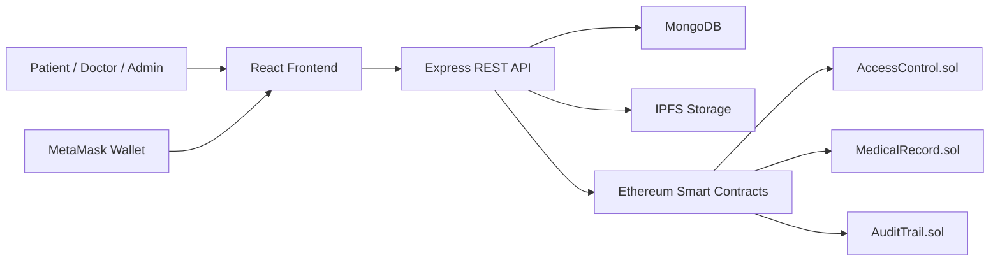
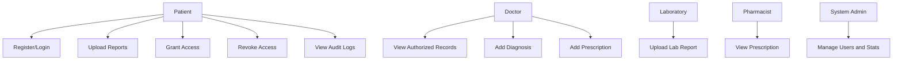
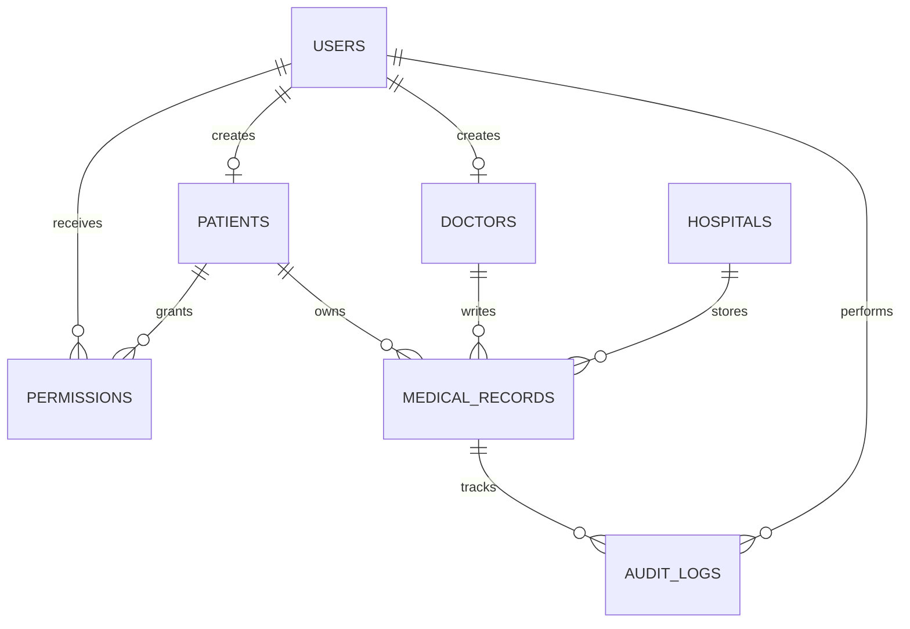
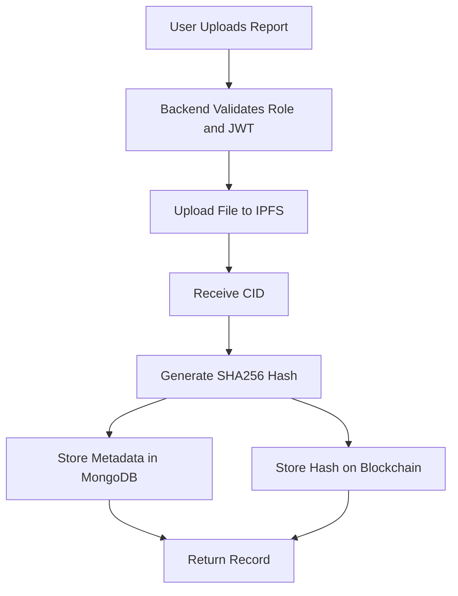
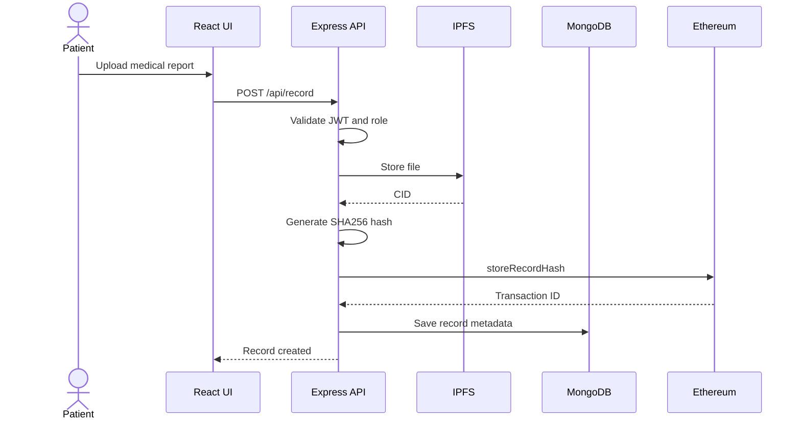

# Blockchain-Based Healthcare Record System

## 1. Abstract

The Blockchain-Based Healthcare Record System is a decentralized electronic health record platform where patients own their medical data and can grant or revoke access to doctors, hospitals, laboratories, and pharmacists. Large medical files are stored off-chain using IPFS-compatible storage, while SHA256 hashes and permission events are stored on Ethereum smart contracts to provide tamper evidence and auditability.

## 2. Introduction

Healthcare records are often scattered across hospitals, clinics, laboratories, and pharmacies. This creates duplication, slow verification, and weak patient control. The proposed system combines a web application, secure REST API, MongoDB, IPFS storage, and Ethereum smart contracts to make health records portable, verifiable, and access controlled.

## 3. Problem Statement

Traditional healthcare record systems are centralized and institution-controlled. Patients cannot easily control who accesses their records, medical histories can be difficult to verify, and audit trails are often incomplete. A secure, decentralized, role-based system is required to improve trust, privacy, and transparency.

## 4. Existing System

- Hospital-centric record ownership
- Manual report sharing through paper, email, or messaging apps
- Limited tamper detection
- Weak cross-institution interoperability
- Centralized audit trail controlled by a single organization

## 5. Proposed System

The system allows registered patients to manage profiles, upload reports, and control permissions. Doctors and other healthcare roles can view or update records only when authorized. IPFS stores the documents, MongoDB stores application metadata, and Ethereum smart contracts store record hashes and permission/audit events.

## 6. Objectives

- Secure electronic health records
- Blockchain-based record verification
- Patient-controlled access management
- Tamper-proof medical history
- Decentralized file storage
- Role-based authorization
- Smart contract-based permissions
- Complete audit trail

## 7. Architecture Diagram

## 8. Use Case Diagram

## 9. ER Diagram

## 10. Data Flow Diagram

## 11. Sequence Diagram

## 12. Testing

### Backend Tests

- Authentication validation
- Protected route access
- Permission grant and revoke flow
- Medical record verification
- Audit log creation

### Smart Contract Tests

- Store record hash
- Verify valid hash
- Reject changed hash
- Grant and revoke permissions
- Append audit entries

### Frontend Tests

- Registration and login navigation
- Role-specific dashboard rendering
- Record search and verification UI
- Permission form validation
- Admin statistics rendering

## 13. Results

The completed prototype demonstrates secure user registration, JWT login, role-based dashboards, patient profile storage, medical record metadata, IPFS-style report CIDs, blockchain-style record hashes, access permissions, QR sharing, and audit logs.

## 14. Future Scope

- Live Pinata/Web3.Storage integration
- Ethers.js contract calls from the backend
- Multi-hospital onboarding workflow
- Patient consent expiry automation
- FHIR-compatible health data import/export
- Mobile application
- Cloud deployment with CI/CD

## 15. Conclusion

This project demonstrates how blockchain can strengthen healthcare record management by separating heavy file storage from immutable verification. Patients gain access control, doctors receive trusted records, and administrators can audit activity without compromising private medical documents.

